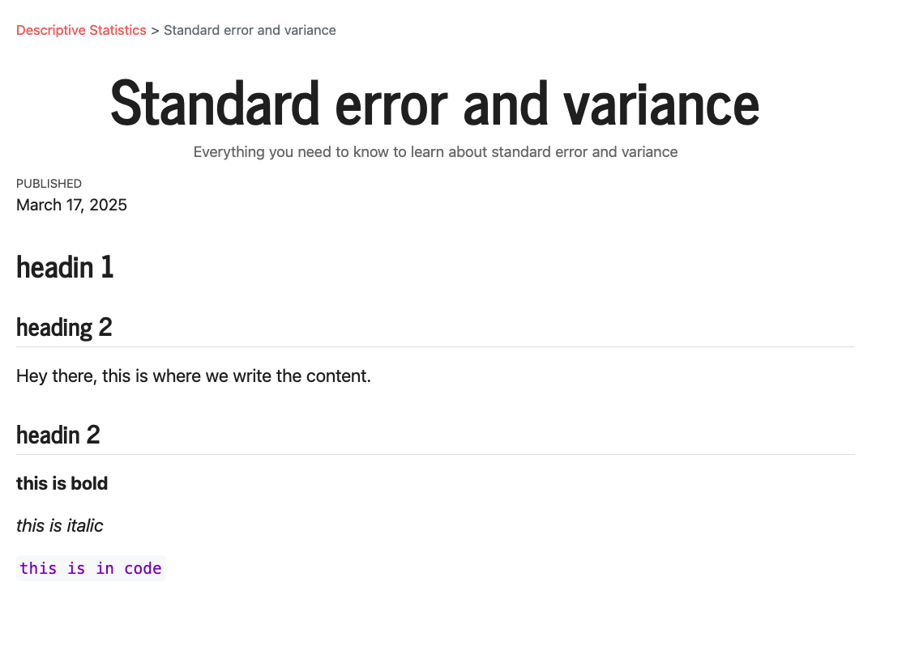

## Create a new article

All articles must be described in the `_quarto.yml` file (global configuration of the website), and it will looks like this:

```yaml
- href: learn/index.qmd
   text: "Introduction"
- text: "---"
- section: "Descriptive Statistics"
   contents:
   - href: learn/descriptive-statistics/average-median-and-mode.qmd
      text: Average, median and mode
   - href: learn/descriptive-statistics/standard-error-and-variance.qmd
      text: Standard error and variance
- text: "---"
```

In this case, we have 2 articles: one named _"Average, median and mode"_ (its content is stored in the `learn/descriptive-statistics/average-median-and-mode.qmd` file) and one named _"Standard error and variance"_ (its content is stored in the `learn/descriptive-statistics/standard-error-and-variance.qmd`).

Each article must have an `href` (where is the quarto file associated, starting from root) and a `text` (text that will appears on the website).

When you open an article, it will looks like this:

```md
---
title: Standard error and variance
description: "Everything you need to know to learn about standard error and variance"
date: today
---

# headin 1

## heading 2

Hey there, this is where we write the content.

## headin 2

**this is bold**

_this is italic_

`this is in code`
```

There is the font header, separated by `---`, where we expect a title, a short description, and the date (just put "today", it will then translate it automatically).

And then everything that happens after it's markdown content. For example, the above article will looks like this:


